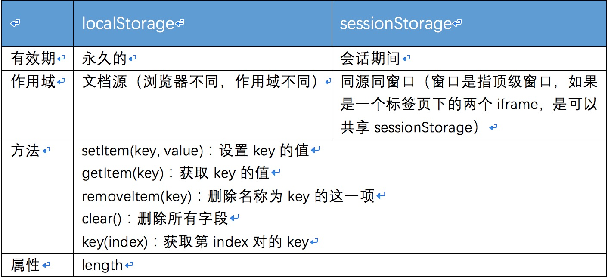
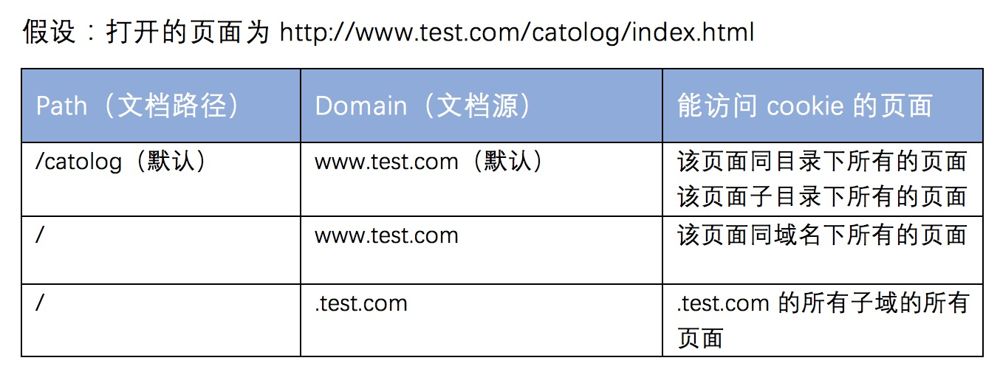

# 客户端存储
1. 客户端存储遵循“同源策略”
2. 客户端存储的几种形式
* Web存储：localStorage和sessionStorage
* cookie
* IE User Data
* 离线Web应用
* Web数据库
* 文件系统API

## Web存储
1. 包含：localStorage对象和sessionStorage对象，这两个对象是持久化关联数组，是名值对的映射表。
2. 存储API
* 
* 数据存储和获取，可以使用对象属性的形式来获取，如下：
```
  localStorage.o = "name"
  localStorage.o // name
```
* 但是这样存取数据有个问题，如果存储的数据支持对象和数组类型，那么通过`localStorage.o`获取的是存储的对象的副本，这样对数据的修改不会生效
  - 测试
  
  ```
    localStorage.o = {name: "test"}
    localStorage.o.name = "test1"
    localStorage.o.name //test 这个值并没有改变，因为localStorage.o获取的是数据副本
  ```
  
3. 存储事件
* 存储的数据发生改变，浏览器都会在其他对该数据可见的窗口对象上触发存储事件（除了对数据进行改变的窗口）
* 存储事件采用广播机制，浏览器会对目前正在访问相同站点的所有窗口发送消息
* 事件为：onStorage，可以通过addEventListener和attachEvent绑定事件
* 与存储事件相关的时间对象有5个重要的属性
  * key
  * newValue
  * oldValue
  * storageArea
  * url
  
## Cookie
1. 特征：
* 只存储少量的文本数据
* 任何以cookie形式存储的数据，不论服务器是否需要，每次HTTP请求都会把这些数据传输到服务器端

2. 服务端操作cookie和客户端操作cookie的区别
* 客户端使用cookie是不安全的，服务端是安全

### 客户端的Cookie
1. 检测cookie是否可用：navigator.cookitEnabled

2. cookie的作用域和有效期
* 默认有效期
  - 持续在浏览器的会话期间（区别于sessionStorage：和整个浏览器进程有关而不是单个窗口）
  - max-age：通过这个值改变默认有效期
* 作用域
  - 
  
3. 安全性
* 通过secure属性设置
* secure: true：浏览器和服务器只能通过Https和其他安全协议连接

4. cookie的操作
* 设置cookie
```
//设置了一个cookie，键值对为test=a，有效时间为100s，文档路径为/，文档源为.test.com，以安全形势传输
document.cookie = 'test=a;max-age=100;path=/;domain=.test.com;secure'
```
* 修改cookie(通过重新设置cookie）
```
//修改cookie的时候，cookie的名字、路径和域必须一样

//这个cookie由于domain和前面不一样，这段代码只会新增cookie，而不会修改原有的cookie
document.cookie = 'test=a;path=/;'

//同名字、路径和域才能修改成功，如下
document.cookie = 'test=a;max-age=100;path=/;domain=.test.com;'
```
* 删除cookie（通过设置max-age为0来删除）
* 读取cookie：`document.cookie`
  - 读取的值包含所有的cookie，但是不包含其属性
  
> cookie设置和读取需要进行编码和解码
> 标准中，cookie总个数限制为300个，为每个服务器保存的cookie不能超过20个，cookie的大小不能超过4KB


